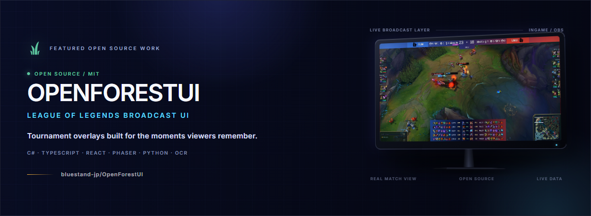

  

<h1 align="center">Negi / yakuminegi</h1>

  AI Engineer · Forward Deployed Engineer · AI Consultant · Event Planner / Web Creator

## AIで、遊びと熱狂のつくり方を変える。

仕事では、AIプロダクトの企画・実装から現場導入までを横断しています。個人開発では、eスポーツを起点に、大会運営・配信・観戦体験を変える仕組みをつくっています。次に見据えているのは、AI × エンタメ全体です。

**Changing how we play, compete, and feel the excitement—with AI.** 
I work across AI product strategy, engineering, and real-world deployment. In my independent work, I use esports as a starting point to rethink tournament operations, broadcasting, and the spectator experience—then carry those ideas into entertainment more broadly.

## Featured Work / 代表作

### [OpenForestUI](https://github.com/bluestand-jp/OpenForestUI)

League of Legendsの大会配信を拡張する、オープンソースの配信UIフレームワークです。チャンピオン選択画面と試合中オーバーレイを中心に、C#/.NET、TypeScript、React、Phaser、Python/OCRを横断して開発しています。

An open-source framework for League of Legends tournament broadcasts, spanning champion-select and in-game overlays across C#/.NET, TypeScript, React, Phaser, and Python/OCR. Published under the MIT License in the `bluestand-jp` organization.

**[View the repository →](https://github.com/bluestand-jp/OpenForestUI)**

## Now Building / いまつくっているもの

大会運営を、もっと軽く、正確にするための**大会運営自動化ツール**を開発しています。まだ公開前のため、ここでは目指している体験だけを紹介します。

I am building a **tournament operations automation tool** to make competitive events easier to run and more reliable. It is not public yet, so this profile shares the direction—not private product details.

## Capabilities / できること

- **AI Engineering & FDE** — AIプロダクトを、構想から実装・現場導入まで。 / From AI product concept to implementation and field deployment.
- **AI Consulting** — 技術選定だけでなく、事業と現場に届く形へ。 / Turning AI strategy into systems that work in practice.
- **Web & Creative Development** — Webプロダクト、配信UI、体験設計。 / Web products, broadcast interfaces, and experience design.
- **Esports & Events** — 大会運営とコミュニティの解像度を、開発に持ち込む。 / Bringing tournament and community context into product development.

## Connect / つながる

  <a href="https://x.com/y4kum">X — @y4kum</a>
  &nbsp;·&nbsp;
  <a href="https://bluestand.jp">BlueStand</a>
  &nbsp;·&nbsp;
  <a href="https://github.com/yakuminegi">GitHub</a>

